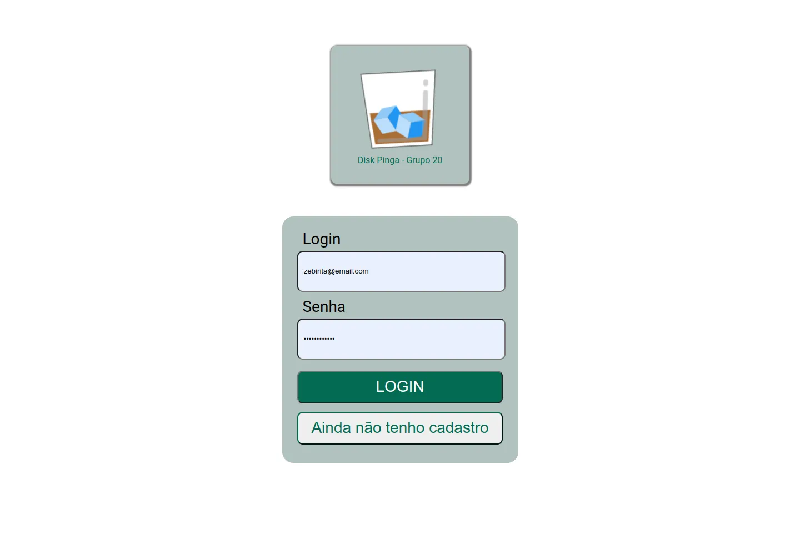
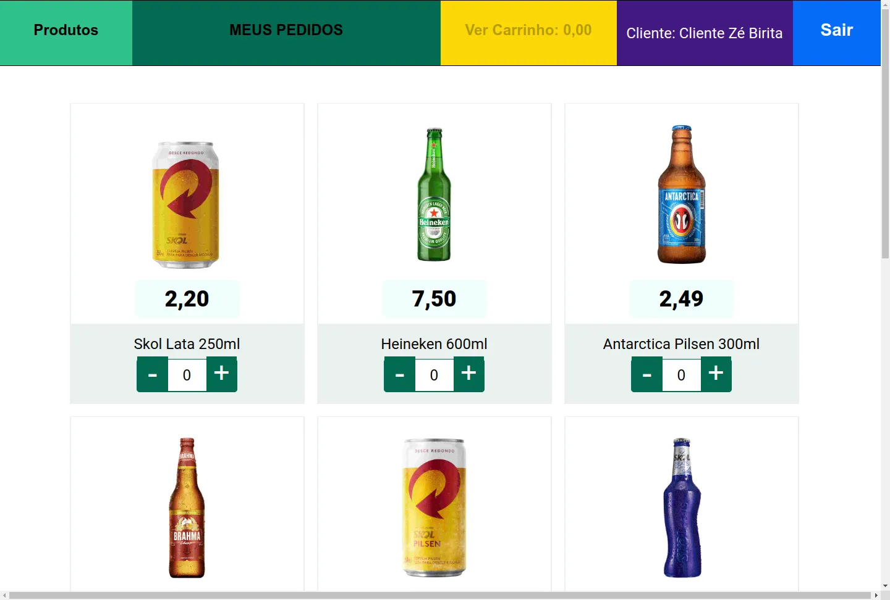
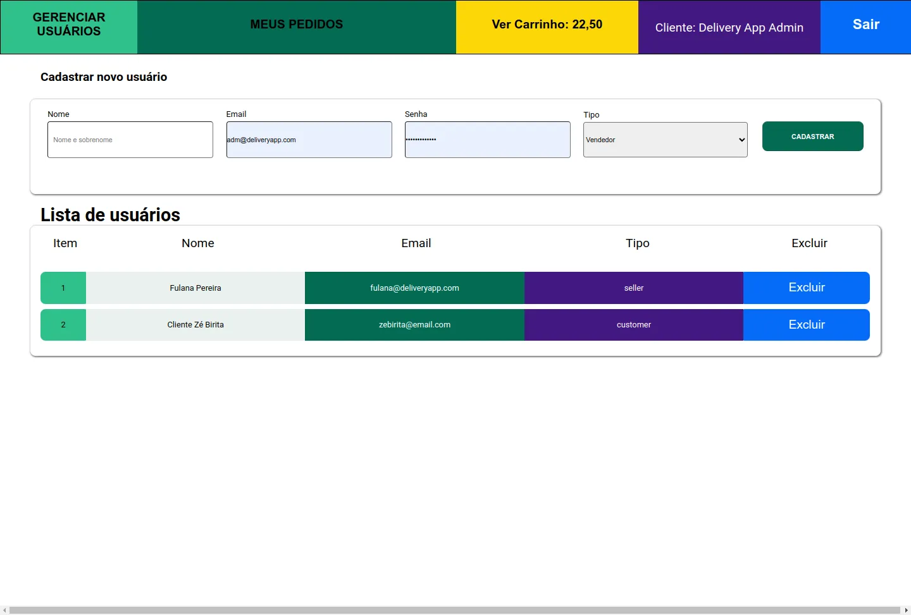
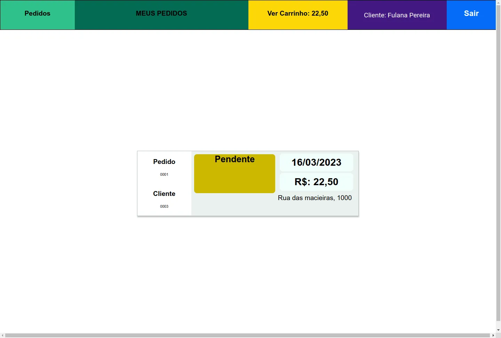
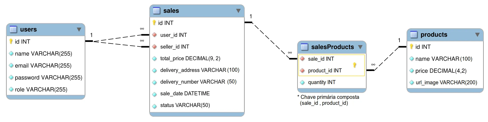

# Delivery App

## Contexto

A distribuidora de cervejas da dona Tereza está se informatizando! rocket Seu negócio, antes focado em um local específico da cidade, passou a receber uma quantidade massiva de encomendas de outros pontos, expandindo sua atuação via delivery. Isso tudo graças ao excelente preço das bebidas e atendimento da equipe de vendas.

Agora a distribuidora possui alguns pontos de venda na cidade para agilizar no atendimento dessas áreas. Cada ponto de venda, por sua vez, possui uma pessoa vendedora responsável.

Como seu antigo sistema, que era um conjunto de planilhas, já não atende a necessidade do negócio por gerar muita manutenção, dona Tereza procurou a sua equipe de pessoas desenvolvedoras com uma ideia de aplicativo que pudesse agilizar a vida de sua equipe e das pessoas que compram seus produtos. O aplicativo precisa:

- Ter acesso via login: tanto clientes como pessoas vendedoras, assim como a própria dona Tereza, que administra o sistema, devem ter acesso ao aplicativo via login, porém para funções diferentes: (1) A pessoa cliente, que compra da lista de produtos; (2) A pessoa vendedora, que aprova, prepara e entrega; (3) A pessoa administradora, que gerencia quem usa o aplicativo;
- Fazer a comunicação entre clientes e pessoas vendedoras: a pessoa cliente faz o pedido via "carrinho de compras" e a pessoa vendedora aprova, prepara e envia esse pedido. Quando o produto é recebido por quem comprou, essa pessoa marca o pedido como "recebido". Ambos devem possuir detalhes sobre seus pedidos;
- Se a pessoa cliente faz o pedido, o mesmo deve aparecer para a pessoa vendedora em seu dash de pedidos após a atualização da página. A pessoa cliente, por sua vez, deve ter as informações sobre seu pedido quando sua página for atualizada, ou seja, ter informações se o pedido está sendo preparado ou se já saiu pra entrega;


<!-- 
> Utiliza a API []()
 -->

---

Colegas que contribuíram para a realização do projeto:

- [@André Souza](https://github.com/dedojs "github")
- [@Gabriel](https://github.com/gabsufrrj "github")
- [@Jhony Mike Altoé](https://github.com/JhonyAltoe "github")
- [@Marcilio Lima](https://github.com/MarcilioamiL "github")

## Técnologias usadas

Front-end:
> Desenvolvido usando: React, CSS3, HTML5, Javascript, JWT

Back-end:
> Desenvolvido usando: Node.js, Express.js, Javascript, ES6, MYSQL, Sequelize ORM,Docker, JWT, Mochajs, Chaijs, SinonJs.

## Habilidades

Adquiri essas habilidades ao desenvolver esse projeto:

## Preview da Aplicação

| Aplicativo de delivery                           | Disk Pinga🥛                                       |
| :---:                                            | :---:                                              |
| Login                                            | Home                                               |
|  |      |
| Carrinho de compras                              | Pedidos                                            |
|    |  |
| Painel do admnistrador                           | Painel do Vendedor                                 |
|    |  |

## Instalando Dependências

- clone o projeto:

  ```bash
  git clone git@github.com:Andreyrvs/33-delivery-app.git && 
  cd 33-delivery-app
  ```

  > Banco de Dados

  | .   | Diagrama DER                                          | .   |
  | --- | :---:                                                 | --- |
  |     |  |     |
  | .   |                                                       | .   |

  ```bash
  cd back-end &&
  docker compose up -d
  ```

  ```bash
  cd .. &&
  npm run db:reset
  ```

  > Backend && Frontend

  ```bash
  npm run dev:prestart

  ```

## Executando aplicação

- Para rodar o back-end && front-end:

  ```bash
  npm run dev
  ```

## Executando Testes

- Para rodar todos os testes do back-end:

  ```bash
  # na raiz do projeto
  npm run pretest
  cd back-end
  test:coverage
  ```

- Para rodar todos os testes do front-end:

  ```bash
  # na raiz do projeto
  npm run pretest
  cd front-end
  test:coverage
  ```
